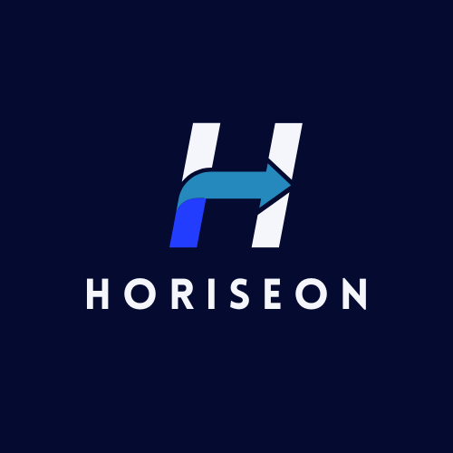
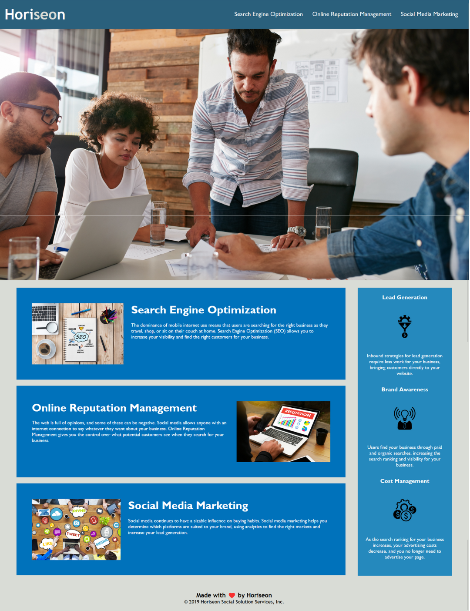

<!-- PROJECT LOGO -->
 

  

  <h2 align="center">Horiseon Landing Web Page</h2>
  <h4 align="center">HTML & CSS Project</h4>

  

The objective of this project is to refactor, by using some good practices like DRY (Don't Repeat Yourself) and the Scout Rule that states to always leave the code a little cleaner than when you found it. Also review the semantic and structure of the HTML, elements follow a logical structure independent of styling and positioning and the CSS Rules with comments. 
     
     
    <a href="https://github.com/RaulMaya/Horiseon-Landing-Page">Repository</a>    
    ·
    <a href="http://127.0.0.1:5501/horiseon-landing-page">Deployment</a>
    ·
    <a href="https://www.linkedin.com/in/raul-maya/">My LinkedIn</a>

  

<!-- ABOUT THE PROJECT -->
### About The Project

The project was developed using tools such as HTML and CSS, the project consist in refactor, clean and make functional the landing web page for Horiseon. Horiseon, as a marketing agency want a codebase that follows accessibility standards so that the own site is optimized for search engines.

The API Developed is fully functional and can handle:
1. Creating and updating user profiles.
2. Login and authentication.
3. Posting status updates.
4. Viewing status update feeds.

|
 Horiseon Landing Page  
|
| --- |
|  |

### Contact :iphone:

* Name: Raul Maya Salazar
* Phone: +52 833 159 7006
* E-mail: raulmayas20@gmail.com
* GitHub: https://github.com/RaulMaya
* LinkedIn: https://www.linkedin.com/in/raul-maya/

(<a href="#top">back to top</a>)
